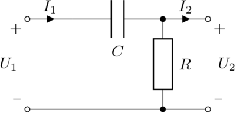

jekyll-liquid-pdflatex-plugin
==========================

[Jekyll](http://Jekyllrb.com/) plugin that defines a useful Liquid Tag for rendering blocks of [LaTeX](http://en.wikipedia.org/wiki/LaTeX‎) code inside a post

Installation
============

Just copy the `liquid_pdflatex.rb` file to your `_plugins` folder.

Requirements
============

Obviously you must have a LaTeX installation of some kind (like [TeXLive](http://www.tug.org/texlive/)).
The following commands (orsimilar) are needed: 
 - pdflatex
 - pdfcrop
 - convert
.

Configuration
=============

There are several configuration parameters that you can define in your `_config.yml`. Here is a sample of such items:

    # ...
    # ... your _config.yml file ...
    # ...

    # Liquid-LaTeX plugin example
    liquid_pdflatex:
      debug: false
      density: 300
      resize: 300x300 
      usepackages: tikz,circuitikz[european resistors, american inductors]
      output_directory: /_latex
      latex_cmd: "pdflatex -interaction=nonstopmode -output-directory $output-directory $texfile > /dev/null 2>&1"
      pdfcrop_cmd: "pdfcrop $pdffile $pdffile > /dev/null 2>&1"
      convert_cmd: "convert -fuzz 10% -transparent white -density $density $resize_opt $pdffile $pngfile  > /dev/null 2>&1"

An explanation of those parameters follows:

*   `debug` (boolean): Activates the debug mode with which you can see the compilation commands that are executed during build. Default value: `false`
*   `density` (numeric): Density for the conversion of PDF to PNG. Default value:`300`
*   `resize` (nil or height times width) Size of the created PNG. If not set, the PNG will not be resized, else it will be height times width pixels. Default value: `not set`
*   `usepackages` (list of comma-separated strings with optional arguments): Name of the packages that will be passed globally to each block of LaTeX code. They will be added individually to their corresponding `\usepackage[...]{...}` lines in the temporary $\LaTeX$ file. Default value: empty string (no packages)
*   `output_directory` (web path): Path in which the generated PNG will be placed. Default value: `/_latex`
*   `latex_cmd` (string): Command line to execute for the `.tex` to `.pdf` conversion. Default value: `pdflatex -interaction=nonstopmode -output-directory $output-directory $texfile > /dev/null 2>&1`
*   `pdfcrop_cmd` (string): Command line to crop the`.pdf`. Default value: `pdfcrop $pdffile $pdffile > /dev/null 2>&1`
*   `convert_cmd` (string): Command line to execute for the `.pdf` to `.png` conversion. Default value: `convert -fuzz 10% -transparent white -density $density $resize_opt $pdffile $pngfile  > /dev/null 2>&1`

In these last three parameters you can use the following variables:

*   `$texfile`: Name of the LaTeX temporary file
*   `$pdffile`: Name of the generated PDF file
*   `$pngfile`: Name of the generated PNG file
*   `$density`: Density value that will be used by the conversion
*   `$output-directory`: output_directory as set in _config
*   `$resize_opt`: String which is either empty if no resize was defined or is equal to -resize=heightxwidth

This variables makes you able to choose which software you use for the whole conversion process. The sample shown above, as well as the default parameters, where defined for use with TeXLive and ImageMagick.

If your don't use a certain parameter, it will take the default value. If you are happy with all the default values you can omit the `liquid-pdflatex` section in your `_config.xml`.

Usage
=====

The tag can be modified by the use of two parameters:

* `density` overrides the default density set in the `_config.yml` file or the internal default value. The value put here will take precedence.

* `resize` overrides the default resize set in the `_config.yml` file or the internal default value. The value put here will take precedence.

* `usepackages` adds a list of packages to the ones set in the `_config.yml` file. This allows you to fix some common packages in the global configuration of the site and specify additional ones as you need them in each tag.

All parameters must be specified in a `variable=value` style. For example:


    
    ...
    


Sample usage
============

You can type the following block of LaTeX inside one of your posts:


\begin{circuitikz}
\draw (1,2) to [C, l_=$C$, -*] (3,2);
\draw (3,2) to[R=$R$] (3,0);
\draw (0,0) to[short, o-*] (3,0) to[short, -o] (4,0);
\draw (0,0) to [open, v^>=$U_1$] (0,2);
\draw (0,2) to [short, o- ,i=$I_1$] (1,2);
\draw (4,0) to [open, v>=$U_2$] (4,2);
\draw (3,2) to [short, -o ,i=$I_2$] (4,2);
\end{circuitikz}


    
    \begin{circuitikz}
    \draw (1,2) to [C, l_=$C$, -*] (3,2);
    \draw (3,2) to[R=$R$] (3,0);
    \draw (0,0) to[short, o-*] (3,0) to[short, -o] (4,0);
    \draw (0,0) to [open, v^>=$U_1$] (0,2);
    \draw (0,2) to [short, o- ,i=$I_1$] (1,2);
    \draw (4,0) to [open, v>=$U_2$] (4,2);
    \draw (3,2) to [short, -o ,i=$I_2$] (4,2);
    \end{circuitikz}
    

And you will get an highpass filter rendered by the `circuitikz` package:

If you copy this example, don't forget to install the `circuitikz` package in your LaTeX installation before trying to build your site. If not, the build process will stop and you'll get the original LaTeX code inside your post as a block of code. That's how this plugin will behave when your LaTeX code contains errors and cannot be compiled.

In this case, you would probably need to install the `circuitikz` package.

Notes
=====

*   The plugin doesn't recompile a previously rendered block of LaTeX. It takes into consideration a change in the text or a change in the arguments (density, resize and packages used). This reduces the total time of the building process.

    Aside, you can delete all the contents of your LaTeX generated blocks in the source directory if you want to make a backup copy of your site. It will be completelly regenerated when you rebuild your site.

*   Also, this plugin keeps the folder of generated images in a clean state. That is, there will be only those images that are used in your site. All previously generated images will be deleted if they are detected as orphaned from the posts.
